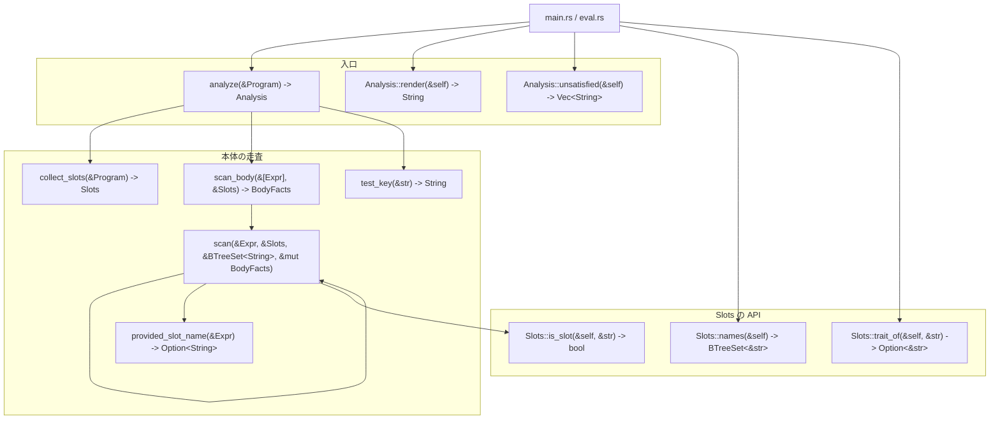
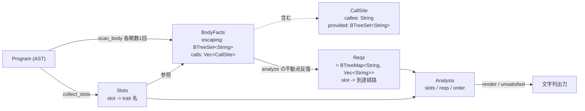

# `src/requirement.rs` の関数地図

シグネチャと呼び出し関係。中身の説明はソースのドキュメントコメントにある。

## 呼び出し関係

`scan` の自己ループが全部。手順2（スロット使用）・手順3（呼び出し辺）・
手順4（提供による打ち消し）を、本体1回の再帰で同時に集めている。

## データの流れ

## 手順との対応

| 手順 | 関数 | 書いた人 |
|---|---|---|
| 1 | `collect_slots` | 手書き |
| 2 | `scan` の `Field` 腕 | 代筆（元は手書きの `direct_uses`） |
| 3 | `scan` の `Call` 腕 | 代筆（元は手書きの `calls`） |
| 4 | `scan` の `Head::Ambient` 腕 | 代筆 |
| 5 | `analyze` の `loop` | 代筆 |
| 6 | `Analysis::unsatisfied` | 代筆 |

手順2・3は最初 `direct_uses` / `calls` として別々に手書きしたが、
手順4で `provided` を持ち回る必要が出た時点で `scan` に畳んだ。
実装が2本あると片方だけ直して食い違うので、実装は1本にしてある。
検査は残っていて、`手順2_*` / `手順3_*` のテストは `scan_body` の
`escaping` と `calls` を見ている。
