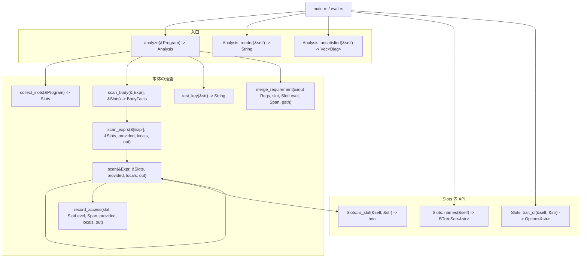
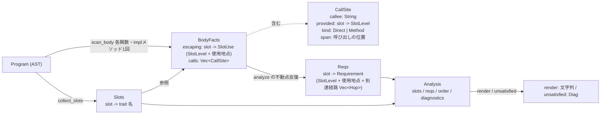

# `src/requirement.rs` の関数地図

シグネチャと呼び出し関係。中身の説明はソースのドキュメントコメントにある。

## 呼び出し関係

`scan` の自己ループが中心。手順2（型射影・値射影のスロット使用）・手順3
（呼び出し辺）・手順4（提供による打ち消し）を、本体1回の再帰で同時に集める。
`locals`は順番に更新し、同名ローカルが見えている場所ではスロット使用に数えない。

## データの流れ

## 手順との対応

| 手順 | 関数 | 書いた人 |
|---|---|---|
| 1 | `collect_slots` | 手書き |
| 2 | `scan` の `Field` 腕 | 代筆（元は手書きの `direct_uses`） |
| 2 | `scan` の `Path` 腕 | 代筆（型射影の要求） |
| 3 | `scan` の `Call` 腕 | 代筆（元は手書きの `calls`） |
| 4 | `scan` の `Head::Ambient` 腕 | 代筆 |
| 5 | `analyze` の `impl` 収集と `loop` | 代筆 |
| 6 | `Analysis::unsatisfied` | 代筆 |

手順2・3は最初 `direct_uses` / `calls` として別々に手書きしたが、
手順4で `provided` を持ち回る必要が出た時点で `scan` に畳んだ。
実装が2本あると片方だけ直して食い違うので、実装は1本にしてある。
検査は残っていて、`手順2_*` / `手順3_*` のテストは `scan_body` の
`escaping` と `calls` を見ている。

`SlotLevel`は`Type < Value`。`db::new()`は`Type`、`db.save()`は`Value`を要求する。
実体提供は両方を満たすが、型提供は`Value`要求を満たさない。
スロット経由のメソッド呼び出しはtrait単位、`Type::method()`は型単位の
`impl`呼び出し辺にもなり、メソッド本体で生じた要求を呼び出し元へ伝える。

## 到達経路の描き方

`Requirement.path` は `Hop { name, span }` の列で、**先頭が直近の呼び出し先、
末尾が実際にスロットを使っている関数**。`name` は呼び先の関数名、`span` は
その呼び出しが書かれている**呼び出し元**の位置になる。

`Analysis::unsatisfied_for` はこれを1つの `Diag` に畳む。

| 診断の部分 | 中身 |
|---|---|
| 主 span | スロットを実際に使っている地点(`clock.now()`) |
| ラベル | `` `clock` がここで要る`` |
| help | `clock が要る ← stamp ← promote ← main` — 名前だけの1行表現 |
| related | ホップごとに1件。各件の span はその呼び出しの位置 |

related を使うのは、ADR-0006 のモジュール分割があるかぎり経路がファイルを
跨ぐため。miette の複数ラベルは同一ソース前提なので、跨いだ経路は描けない。
related なら各ホップが自分のファイルの抜粋を持てる。名前だけの1行表現は help に
残してあるので、位置の要らない読み方は従来どおり通じる。

`CallKind`は要求伝播と最低限の名前解決を分ける。`Direct`な呼び出し先が
トップレベル関数に無ければエラーにする。`Method`の存在確認にはレシーバの型が
必要なので、型検査が入るまで要求伝播の辺としてだけ扱う。
